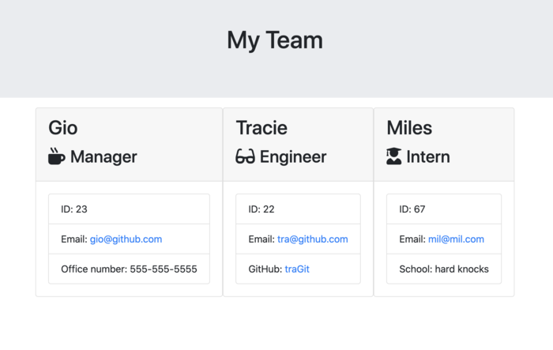

# Template Engine

This application lets the user, through the command line interface, dynamically generate an html template with information gathered through prompts about team members. The amount of members and the roles assigned can vary. After information is passed to html file, it will be displayed in a formatted and easy to read roster breakdown of team.


```
This screeshot shows the user being prompted for input about Manager.
```


```
This screeshot shows the user being prompted for input about Engineer.
```


```
This screeshot shows the user being prompted for input about Intern.
```


```
This screeshot shows the html team page result.
```


## Review URL

[GitHub](https://github.com/GNoisy/10-template-engine)

## Prerequisites

You'll need an IDE such as VS Code or Atom. Copy and paste code into your IDE and you can save file to your local drive.

```
https://code.visualstudio.com/download

https://flight-manual.atom.io/getting-started/sections/installing-atom/
```

## Built With

* [Javascript](https://developer.mozilla.org/en-US/docs/Web/JavaScript)
* [HTML](https://developer.mozilla.org/en-US/docs/Web/HTML)
* [Node.js](https://nodejs.org/en/)
* [Inquirer.js](https://www.npmjs.com/package/inquirer#questions)
* [Jest.js](https://jestjs.io/en/)


## Authors

* **Giovanni Noisy**

- [Github](https://github.com/GNoisy)
- [LinkedIn](https://www.linkedin.com/in/giovanni-noisy-04098989/)

### Acknowledgments

* MDN 
* w3schools


